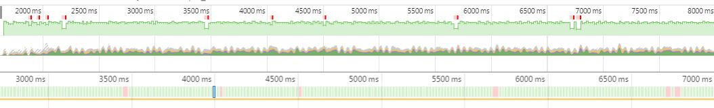

# Website Performance Optimization portfolio project

This is Project #4 of the [Udacity Front-End Web Developer Nanodegree](https://www.udacity.com/course/front-end-web-developer-nanodegree--nd001)

The goal was to optimize a provided website with a number of optimization- and
performance-related issues so that it achieves a target PageSpeed score of 90
and runs at 60 frames per second.

## Getting started
### Live
Point your browser to:

### Locally

1. Clone this repo:

2. Serve the website:
```
$ python -m SimpleHTTPServer
```
or, for Python 3
```
$ python -m http.server 8000
```
## Requirement 1: Critical Rendering Path
Get index.html to a PageSpeed score for the mobile and desktop versions to at
least 90.

### Step 1: Profile

Using ngrok to tunnel the local web server, initial scores were
28/30 for mobile/desktop. The analysis recommended:

Should fixes:

1. Optimize images
2. Eliminate render-blocking JS and CSS in above-the-fold content

Consider fixes:

1. Leverage browser caching
2. Enable compression
3. Minify HTML

### Step 2: Optimize:

1. Optimize images: Google's PageSpeed tool provided two optimized images:
    * profilepic.jpg
    * pizzeria.jpg.
    * They were both sized and compressed. The original images file names were
    renamed with the suffix  "-lg".
2. To eliminate render-blocking JS & CSS, I made these changes:
    * used a media query on the print.css. Now, it will only request the CSS
    file if screen = print
    * added async to the Google analytics script so it doesn't block rendering
    * moved the Google Analytics script to the bottom of the body so it doesn't
    block rendering
    * replaced the Google Font CSS file request to a JS script at the bottom of
    the body, so downloading the fonts won't block rendering

### Step 3: Measure:
After above optimizations, and again using ngrok to tunnel the local web server,
PageSpeed improved to 95/96 mobile/desktop


## Requirement 2: Frame Rate
Refactor view/js/main.js such that views.html renders at a consistent 60 fps

### Step 1: Profile
The performance data generated by the views/js/main.js script itself indicates:

* Time to generate pizzas on load: 30ms
* Average scripting time to generate the last 10 frames: 18.5ms. This is
definitely a problem since the whole frame must be ready every 16.6 ms to maintain
60 fps.
* When the scroll event fires, the handler calls the updatePositions function,
which is taking over 60 ms.
* The timeline using non-optimized main.js can be downloaded [here](#). You'll
notice all the red ticks where the frame rate wasn't 60 fps. Here is
the screen shot:
IMG HERE

### Step 2: Optimize:
First, refactor updatePositions (see comments in below code snippet)
```
function updatePositions() {
  frame++;
  window.performance.mark("mark_start_frame");

  // moved this sin calculation out of the loop. Only unique values are needed.
  var phases = [Math.sin(0), Math.sin(1), Math.sin(2), Math.sin(3), Math.sin(4)];

  // Replaced querySelectorAll with getElementsByClassName per the Project
  // Webcast as it's supposed to be faster
  var items = document.getElementsByClassName("mover");
  for (var i = 0; i < items.length; i++) {
    /* removed: var phase = Math.sin((document.body.scrollTop / 1250) + (i % 5));
       because the sin function is calculating the same five number every time
       through the loop. */

    items[i].style.left = items[i].basicLeft + 100 * phases[i % 5] + 'px';
  }
```
Second, refactor event handler so it generates fewer static pizzas. Fewer
elements to render means fewer elements to lay and paint. See the comment inside
the below code snippet.
```
document.addEventListener('DOMContentLoaded', function() {
  var cols = 8;
  var s = 256;

  /* the original for loop went 200 times. Reduced to 40 and pizzas still fill
  the frame */
  for (var i = 0; i < 40; i++) {
    var elem = document.createElement('img');
    elem.className = 'mover';
    elem.src = "images/pizza.png";
    elem.style.height = "100px";
    elem.style.width = "73.333px";
    elem.basicLeft = (i % cols) * s;
    elem.style.top = (Math.floor(i / cols) * s) + 'px';
    document.querySelector("#movingPizzas1").appendChild(elem);
  }
  updatePositions();
});
```

### Step 3: Measure:
* The scripting time is reduced from 60 ms to under 1 ms.
* No jank present during scrolling, meaning frame rate is above 60fps

* The optimized timeline file is [here](js/TimelineRawData-20160829T220953.json)


## Website Performance Optimization portfolio project

Your challenge, if you wish to accept it (and we sure hope you will), is to optimize this online portfolio for speed! In particular, optimize the critical rendering path and make this page render as quickly as possible by applying the techniques you've picked up in the [Critical Rendering Path course](https://www.udacity.com/course/ud884).

To get started, check out the repository and inspect the code.

### Getting started

####Part 1: Optimize PageSpeed Insights score for index.html

Some useful tips to help you get started:

1. Check out the repository
1. To inspect the site on your phone, you can run a local server

  ```bash
  $> cd /path/to/your-project-folder
  $> python -m SimpleHTTPServer 8080
  ```

1. Open a browser and visit localhost:8080
1. Download and install [ngrok](https://ngrok.com/) to the top-level of your project directory to make your local server accessible remotely.

  ``` bash
  $> cd /path/to/your-project-folder
  $> ./ngrok http 8080
  ```

1. Copy the public URL ngrok gives you and try running it through PageSpeed Insights! Optional: [More on integrating ngrok, Grunt and PageSpeed.](http://www.jamescryer.com/2014/06/12/grunt-pagespeed-and-ngrok-locally-testing/)

Profile, optimize, measure... and then lather, rinse, and repeat. Good luck!

####Part 2: Optimize Frames per Second in pizza.html

To optimize views/pizza.html, you will need to modify views/js/main.js until your frames per second rate is 60 fps or higher. You will find instructive comments in main.js.

You might find the FPS Counter/HUD Display useful in Chrome developer tools described here: [Chrome Dev Tools tips-and-tricks](https://developer.chrome.com/devtools/docs/tips-and-tricks).

### Optimization Tips and Tricks
* [Optimizing Performance](https://developers.google.com/web/fundamentals/performance/ "web performance")
* [Analyzing the Critical Rendering Path](https://developers.google.com/web/fundamentals/performance/critical-rendering-path/analyzing-crp.html "analyzing crp")
* [Optimizing the Critical Rendering Path](https://developers.google.com/web/fundamentals/performance/critical-rendering-path/optimizing-critical-rendering-path.html "optimize the crp!")
* [Avoiding Rendering Blocking CSS](https://developers.google.com/web/fundamentals/performance/critical-rendering-path/render-blocking-css.html "render blocking css")
* [Optimizing JavaScript](https://developers.google.com/web/fundamentals/performance/critical-rendering-path/adding-interactivity-with-javascript.html "javascript")
* [Measuring with Navigation Timing](https://developers.google.com/web/fundamentals/performance/critical-rendering-path/measure-crp.html "nav timing api"). We didn't cover the Navigation Timing API in the first two lessons but it's an incredibly useful tool for automated page profiling. I highly recommend reading.
* <a href="https://developers.google.com/web/fundamentals/performance/optimizing-content-efficiency/eliminate-downloads.html">The fewer the downloads, the better</a>
* <a href="https://developers.google.com/web/fundamentals/performance/optimizing-content-efficiency/optimize-encoding-and-transfer.html">Reduce the size of text</a>
* <a href="https://developers.google.com/web/fundamentals/performance/optimizing-content-efficiency/image-optimization.html">Optimize images</a>
* <a href="https://developers.google.com/web/fundamentals/performance/optimizing-content-efficiency/http-caching.html">HTTP caching</a>

### Customization with Bootstrap
The portfolio was built on Twitter's <a href="http://getbootstrap.com/">Bootstrap</a> framework. All custom styles are in `dist/css/portfolio.css` in the portfolio repo.

* <a href="http://getbootstrap.com/css/">Bootstrap's CSS Classes</a>
* <a href="http://getbootstrap.com/components/">Bootstrap's Components</a>
