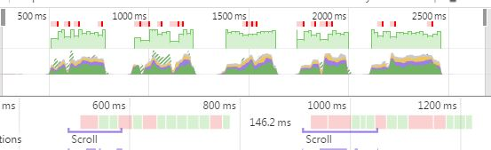
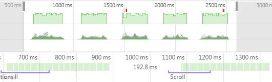
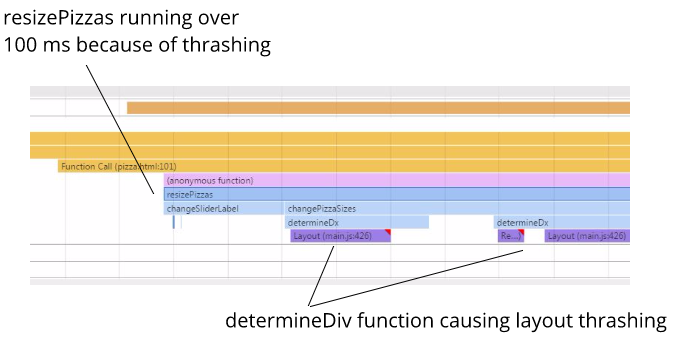

# Website Performance Optimization portfolio project

This is Project #4 of the [Udacity Front-End Web Developer Nanodegree](https://www.udacity.com/course/front-end-web-developer-nanodegree--nd001)

The goal was to optimize a provided website with a number of optimization- and
performance-related issues so that it achieves a target PageSpeed score of 90
and runs at 60 frames per second.

## Getting started
The code for the "before" website can be found [here](https://github.com/udacity/frontend-nanodegree-mobile-portfolio)

The code for the "after" website can be found [here](https://github.com/garyherd/website-optimization)

In addition, the "after" website is hosted [here](https://garyherd.github.io/website-optimization/)

To compare sites:

1. Clone each repo to your local machine:
```
git clone https://github.com/garyherd/website-optimization.git
git clone https://github.com/udacity/frontend-nanodegree-mobile-portfolio.git
```

2. Navigate to the root directory of each project and start a web server
(use different ports for each site):
```
$ python -m SimpleHTTPServer 8080
$ python -m SimpleHTTPServer 8090
```
or, for Python 3
```
$ python -m http.server 8080
$ python -m http.server 8090
```

3.  Tunnel local web servers to the internet using ngrok. Instructions are on the [ngrok site](https://ngrok.com/docs#expose)


## Requirement 1: Critical Rendering Path
Get index.html to a PageSpeed score for the mobile and desktop versions to at
least 90.

### Step 1: Profile

Using ngrok to tunnel the local web server, initial scores were
28/30 for mobile/desktop. The analysis recommended:

Should fixes:

1. Optimize images
2. Eliminate render-blocking JS and CSS in above-the-fold content

Consider fixes:

1. Leverage browser caching
2. Enable compression
3. Minify HTML

### Step 2: Optimize:

1. Optimize images: Google's PageSpeed tool provided two optimized images:
    * profilepic.jpg
    * pizzeria.jpg.
    * They were both sized and compressed. The original images file names were
    renamed with the suffix  "-lg".
2. To eliminate render-blocking JS & CSS, I made these changes:
    * used a media query on the print.css. Now, it will only request the CSS
    file if screen = print
    * added async to the Google analytics script so it doesn't block rendering
    * moved the Google Analytics script to the bottom of the body so it doesn't
    block rendering
    * replaced the Google Font CSS file request to a JS script at the bottom of
    the body, so downloading the fonts won't block rendering

### Step 3: Measure:
After above optimizations, and again using ngrok to tunnel the local web server,
PageSpeed improved to 95/96 mobile/desktop


## Requirement 2: Frame Rate
Refactor view/js/main.js such that views.html renders at a consistent 60 fps

### Step 1: Profile
The performance data generated by the views/js/main.js script itself indicates:

* Time to generate pizzas on load: 30ms
* Average scripting time to generate the last 10 frames: 2.5ms. This is
a potential problem since the whole frame must be ready every 16.6 ms to maintain
60 fps.
* When the scroll event fires, the handler calls the updatePositions function,
which is taking over 2 ms.
* You'll notice all the red ticks where the frame rate wasn't 60 fps. Here is
the screen shot:



### Step 2: Optimize:
See the comments below for the details. In summary, I took a few calculations
out of the loops they were in, and put them in top of the function so they only
get assigned once. I also reduced the number of pizzas from 200 to around 48.
The number is now dynamic, based on screen height

```
function updatePositions() {
  frame++;
  window.performance.mark("mark_start_frame");
  var topPosition = document.body.scrollTop / 1250;
  var phases = [];
  for (var i = 0; i < 5; i++) {
    phases.push(Math.sin(topPosition + i));
  }

  // items = document.getElementsByClassName('mover');
  for (var i = 0; i < items.length; i++) {
    // var phase = Math.sin((document.body.scrollTop / 1250) + (i % 5));
    /* moved the Math.sin calc above out of the loop so it just gets called
     * once, when the function is called */
    items[i].style.left = items[i].basicLeft + 100 * phases[i % 5] + 'px';
  }

  // User Timing API to the rescue again. Seriously, it's worth learning.
  // Super easy to create custom metrics.
  window.performance.mark("mark_end_frame");
  window.performance.measure("measure_frame_duration", "mark_start_frame", "mark_end_frame");
  if (frame % 10 === 0) {
    var timesToUpdatePosition = window.performance.getEntriesByName("measure_frame_duration");
    logAverageFrame(timesToUpdatePosition);
  }
}

// runs updatePositions on scroll
window.addEventListener('scroll', updatePositions);

// Generates the sliding pizzas when the page loads.
document.addEventListener('DOMContentLoaded', function() {
  var cols = 8;
  var s = 256;
  var movingPizzas = document.getElementById('movingPizzas1');
  /* moved the reference above out of the loop below so it only needs to getAdj
   * initialized once - at page load. Also replace query selector with
   * getElementById, which is supposed to be faster. */

  for (var i = 0; i < 35; i++) {
    var elem = document.createElement('img');
    elem.className = 'mover';
    elem.src = "images/pizza.png";
    elem.style.height = "100px";
    elem.style.width = "73.333px";
    elem.basicLeft = (i % cols) * s;
    elem.style.top = (Math.floor(i / cols) * s) + 'px';
    movingPizzas.appendChild(elem);
  }
  /* move the items variable out of the loop above. It's initialized in the
   * global scope, and then assigned a value once, on page load. */
  items = document.getElementsByClassName('mover');
  updatePositions();
});
```

### Step 3: Measure:
* The scripting time is reduced from 60 ms to under 1 ms.
* No jank present during scrolling, meaning frame rate is above 60fps




## Requirement 3: Computational efficiency
Time of resize pizzas is less than 5 ms using the pizza size slider on the
```views/pizza/html``` page.

### Step 1: Profile


### Step 2: Optimize
See the comments in the code

```
  /* Eliminated the determineDx function and extracted this function */
  function sizeSwitcher (size) {
    switch(size) {
      case "1":
        return 0.25;
      case "2":
        return 0.3333;
      case "3":
        return 0.5;
      default:
        console.log("bug in sizeSwitcher");
    }
  }

  var windowWidth = document.getElementById("randomPizzas").offsetWidth;

  function changePizzaSizes(size) {
    var randomPizzas = document.getElementsByClassName("randomPizzaContainer");

    for (var i = 0; i < randomPizzas.length; i++) {
      // var dx = determineDx(randomPizzas[i], size);
      // var newwidth = (randomPizzas[i].offsetWidth + dx) + 'px';
      // var newwidth = sizeSwitcher(size) * windowWidth + 'px';
      randomPizzas[i].style.width = (sizeSwitcher(size) * windowWidth) + 'px';
    }
  }
```

### Step 3: Measure
After the improvements, the time to resize is under 3ms.

Also, it should be noted that the [Udacity forums](https://discussions.udacity.com/c/nd001-website-optimization/website-optimization-project) we very helpful when I got stuck


